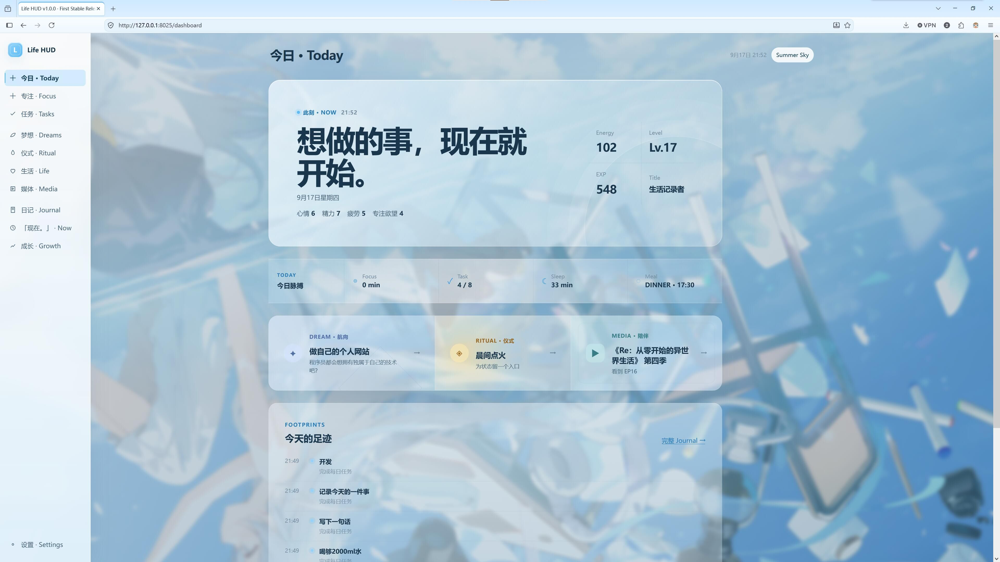
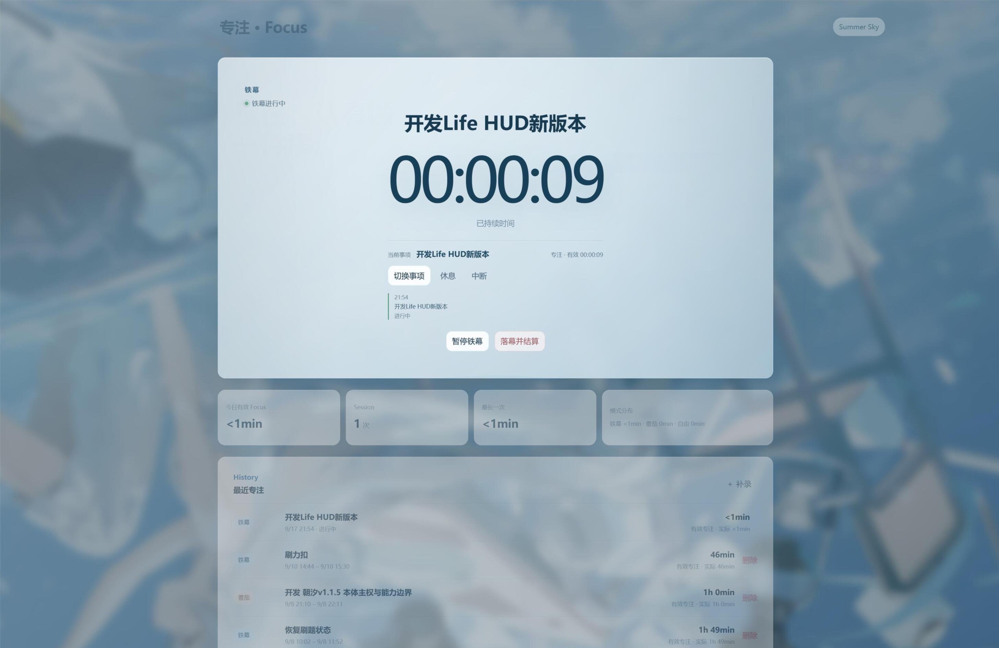
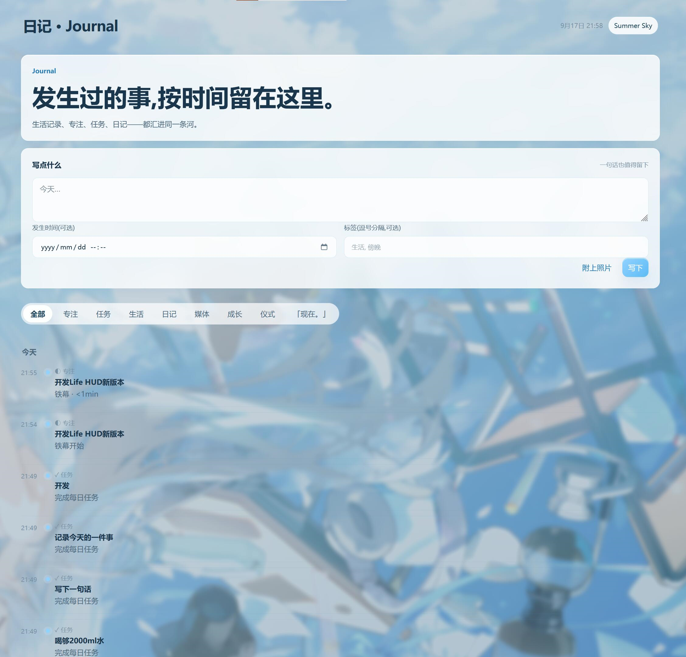
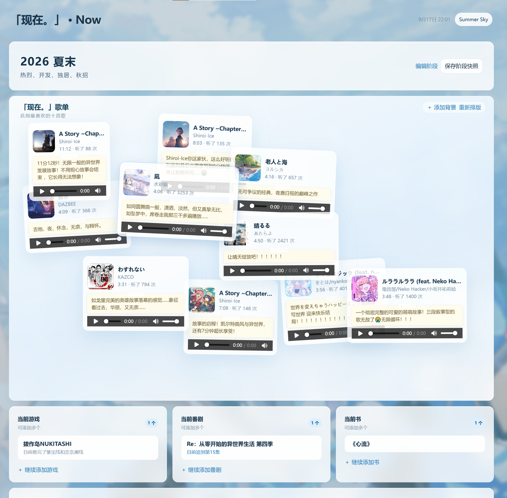
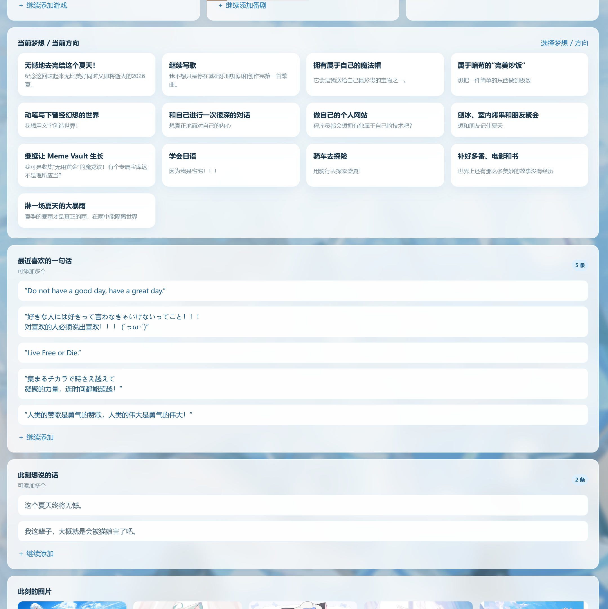
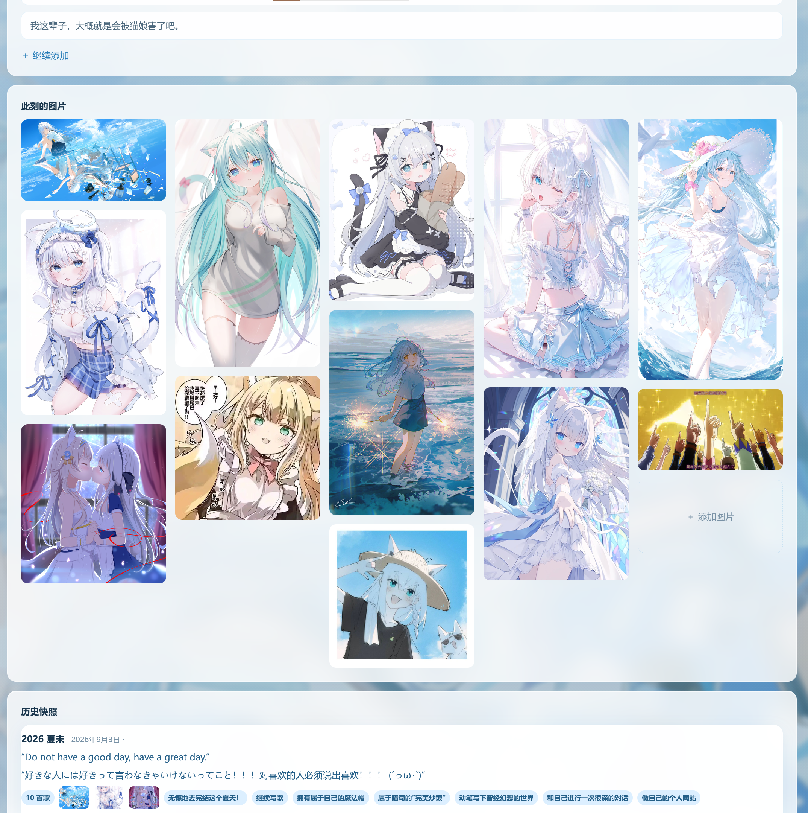
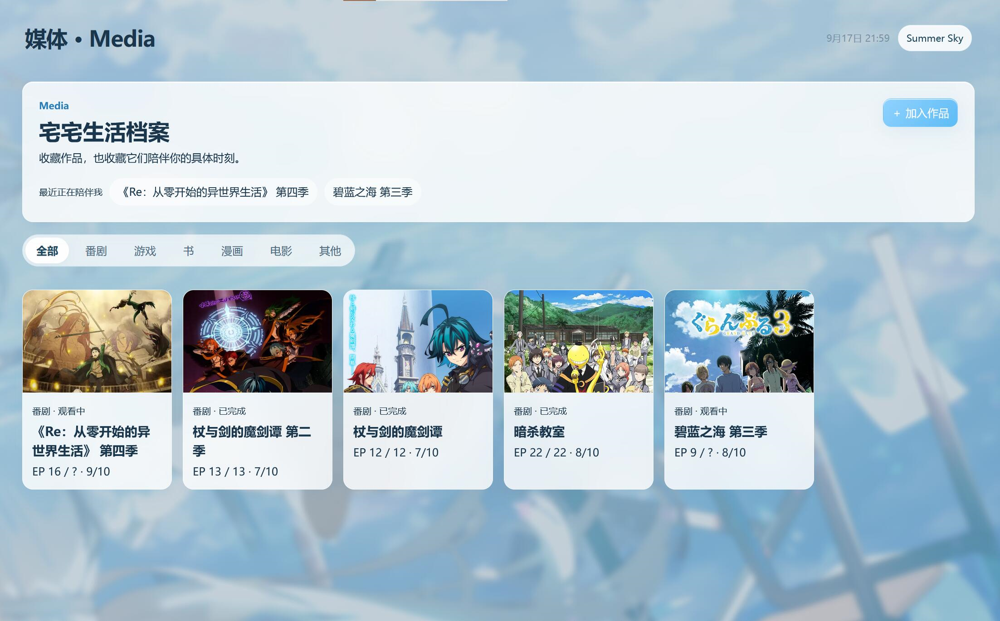
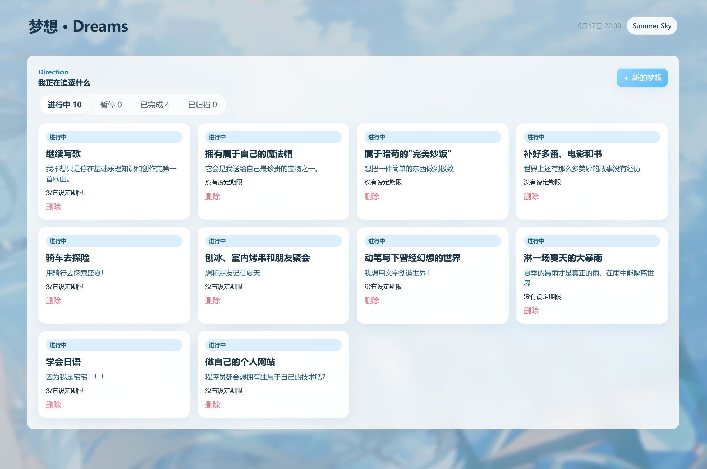
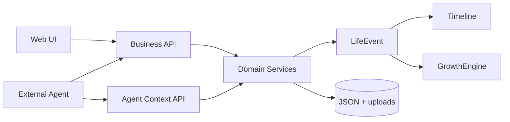

# Life HUD

> 一套围绕个人生活事实构建的本地 Life HUD。

Life HUD 把专注、任务、方向、仪式、生活记录、媒体体验、日记与成长组织在同一个可追溯系统中。它解决的不是“再列一张待办清单”，而是让分散的生活记录成为可信、可回看、可被外部工具使用的个人事实。

**当前正式版本：v1.0.0 · First Stable Release**

**核心技术栈：Java 21 · Spring Boot 3.5.5 · 原生 HTML / CSS / JavaScript · JSON 本地持久化**

`Focus · Tasks · Dreams · Ritual · Life · Media · Journal · Now · Growth`



## 它不只是 Todo / Habit Tracker

普通任务工具通常只关心“是否完成”。Life HUD 更关心一件事在生活中如何发生，以及它与状态、方向和长期成长如何连接：

- Focus 与 Task 记录实际行动；Dream 与 Ritual 保存方向和状态入口。
- Sleep、Meal、Exercise、Check-in、通用生活记录与 Journal 构成日常事实。
- Media 与「现在。」保存作品体验、阶段偏好和当下记忆。
- 所有业务记录通过 `LifeEvent` 汇入 Timeline，并由 Growth 系统进行幂等结算。

系统默认只在本机运行，数据与媒体文件由用户自己持有。

## 核心模块

| 模块 | 作用 |
| --- | --- |
| **Focus System / 铁幕** | 铁幕、番茄与自由专注共用一套可暂停、恢复、完成和中断的 `FocusSession` 状态机；Segment 记录专注、休息与中断，后端保存真实有效时长。 |
| **Dashboard** | 将当前状态、今日专注与任务、方向陪伴、媒体和最近足迹聚合为一张 Today 驾驶舱。 |
| **Life Timeline / Journal** | 睡眠、饮食、运动、Check-in、通用记录与手动日记进入统一时间线，支持按日期、来源和类型筛选，并展示关联图片。 |
| **「现在。」** | 保存当前阶段、十首歌的记忆墙、正在玩 / 看 / 读的内容、梦想方向、句子、图片与阶段快照。 |
| **Media** | 管理 Anime、Game、Book、Manga、Movie 与 Other 档案；观看和游玩 Session 会留下可追溯足迹。 |
| **Dream / Ritual** | 用 Dream → Goal → Milestone 表达长期方向；用仪式、片段与沉浸执行进入一种状态。 |
| **Growth** | 以事实驱动 Energy、EXP、Level、Achievement、Title、Milestone 和趋势快照，避免刷新或重算造成重复奖励。 |

### Focus / 铁幕



铁幕不是另一套计时器，而是 `IRON_CURTAIN` Focus 模式的沉浸表现层。运行、暂停、切换事项和最终结算仍由同一套后端状态机负责，因此刷新页面或切换标签不会丢失真实进度。

### Life Timeline / Journal



业务记录是唯一事实源：创建记录时生成事实，编辑时原位更新并提升版本，删除时同步清理对应事件。Timeline 统一使用 `occurredAt` 表达“何时发生”，补录不会被错误归到创建时间。

### 「现在。」







「现在。」不是统计页，而是一张阶段陈列页。歌曲、图片、方向与阶段快照保留具体对象信息；变化会以 `NOW` 来源进入 Journal，纯文案调整和排版则不会制造无意义事件。

### Media



作品档案与实际观看 / 游玩记录分离。Anime 和 Game Session 维护进度、时间与唯一对应的 `LifeEvent`，书籍、漫画、电影及其他内容保持轻量记录。

### Dream / Ritual



Dream 保存“为什么前进”，Task 可以关联到 Dream、Goal 或 Milestone；Ritual 则保存可复用的仪式定义，并在每次开始时冻结片段快照，形成独立执行记录。

## 工程与架构

- **Java 21 + Spring Boot 3.5.5**：单体本地 Web 应用，HTTP API 与静态前端由同一进程提供。
- **LifeEvent 统一事实模型**：业务域使用稳定的来源类型、来源 ID、发生时间、标签、元数据和 schema version 描述事实。
- **GrowthEngine**：以 `eventId` 幂等处理成长结算；Focus / Task 产出 Energy，娱乐消费按实际消耗沉淀 EXP。
- **JSON 本地持久化**：领域数据保存于用户数据目录，写入使用临时文件与原子替换；旧字段在读取边界兼容。
- **Timeline 聚合**：Focus、Task、Life、Journal、Growth、Ritual、Dream、Now 与 Media 统一投影为按时间排序的 Timeline。
- **图片与媒体资源管理**：图片、封面、壁纸和 MP3 / FLAC 保存在 `uploads/`，按 SHA-256 内容去重；歌曲可读取元数据与内嵌封面。
- **Agent Context API**：提供带 `schemaVersion: "1"` 的强类型只读语义视图。
- **Agent Action API**：外部工具复用现有业务 API 完成写入，保证校验、事件、Timeline 与 Growth 规则只有一条路径。



更完整的领域边界与调用链见 [架构文档](docs/ARCHITECTURE.md)。

## Agent Integration

Life HUD **不内置** LLM、Planner、Prompt、Memory、Permission Engine 或 Agent Runtime。它的职责是成为可信的生活事实与业务系统，而不是在同一进程里同时承担理解、规划和工具执行。

这个边界是有意设计：

- 外部 Agent 通过 `GET /api/agent/context/*` 获取稳定、可解释的聚合上下文。
- 写操作复用 Life HUD 的 Business API，不绕过领域校验，也不直接修改 JSON。
- 权限确认、自然语言理解、工作流、重试策略和跨系统协调由外部 Agent Runtime 负责。
- Context API 与业务写入口分离，避免“为了 Agent”复制第二套业务逻辑。

> 当前 API 无鉴权，只适合本机或可信私有网络，不能直接暴露到公网。

文档入口：

- [API 索引](docs/API_INDEX.md)
- [Agent Context API](docs/AGENT_CONTEXT_API.md)
- [Agent Action API](docs/AGENT_ACTION_API.md)

## Quick Start

要求：**Java 21**。仓库已包含 Maven Wrapper，无需预先安装 Maven。

```powershell
git clone https://github.com/Aomckin/Life-HUD.git
cd Life-HUD
.\mvnw.cmd spring-boot:run
```

浏览器访问 <http://localhost:8025>。

运行测试：

```powershell
.\mvnw.cmd test
```

服务默认绑定 `127.0.0.1:8025`。首次启动会把随包默认 JSON 复制到工作目录下的 `data/`，后续直接读写该目录。

## 数据目录

```text
data/
├─ *.json       # 业务事实、索引、成长回执与快照
├─ content/     # 可配置规则与展示内容
└─ uploads/     # 图片、封面、壁纸、音频与内嵌封面
```

可以通过 Spring 配置项 `lifehud.data-dir` 或环境变量 `LIFEHUD_DATA_DIR` 指定其他目录；旧环境变量 `OTAKU_ENERGY_DATA_DIR` 仍兼容读取。

升级、迁移或恢复时应整体备份数据目录，不能只复制部分 JSON。详见 [备份与恢复](docs/BACKUP_AND_RESTORE.md)。仓库中的 `data/` 是本地运行数据，不应提交真实个人记录或媒体文件。

## 当前状态

**v1.0.0 是首个稳定版本。** 核心业务域、Agent Interface、数据兼容与恢复、响应式页面和正式版 Release Gate 已完成。

当前产品边界：本地单用户、JSON 持久化、生活数据以手动输入为主；没有账户系统、云同步、内置 Agent 或第三方媒体同步。这些是 v1.0 的明确取舍，不是 README 中隐藏的待实现承诺。

- [v1.0 Release Note](docs/RELEASE_V1.0.md)
- [代码状态与交接](docs/CODEBASE_STATUS.md)
- [版本历史](CHANGELOG.md)

## Roadmap

- 在 1.x 中继续提高数据安全、恢复体验、API 契约测试和文档质量。
- 基于真实使用需求扩展现有生活域，不为版本号新增孤立模块。
- 探索独立的 Agent 工具适配层；Life HUD 继续保持事实系统与 Agent Runtime 的架构边界。
