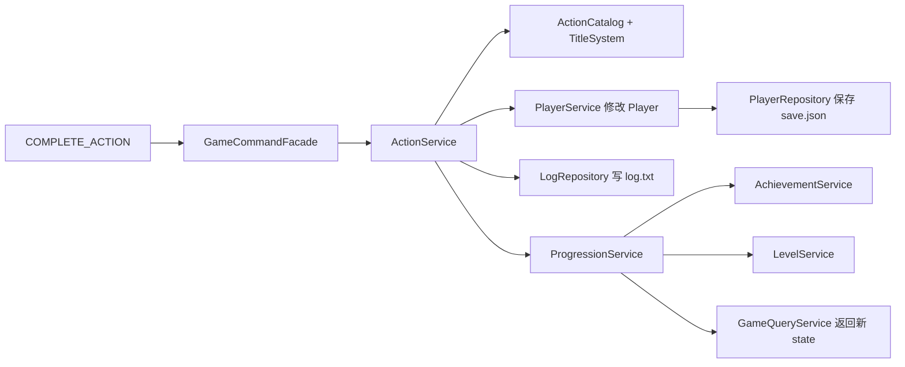
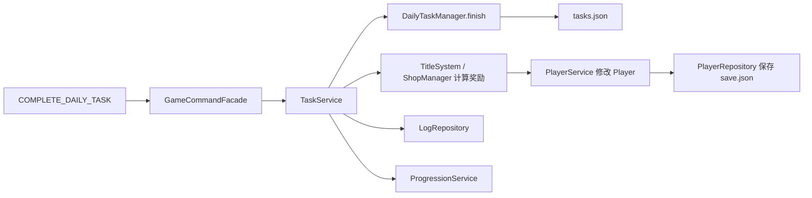
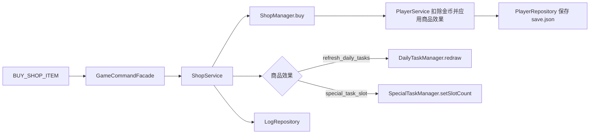
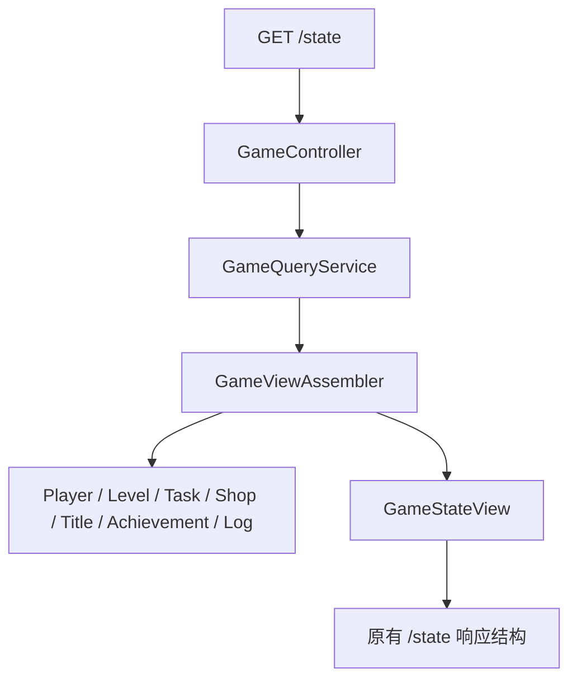
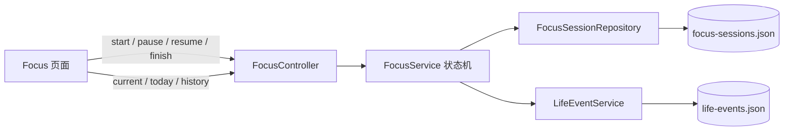
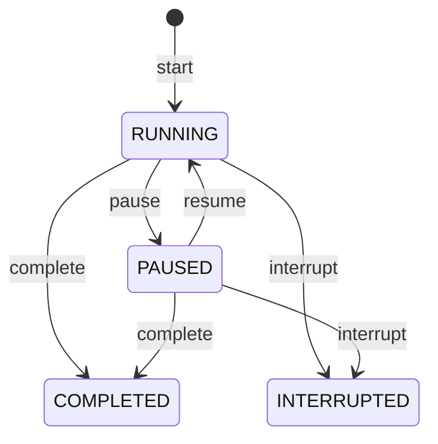
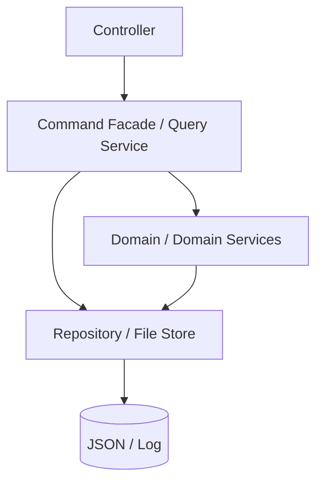
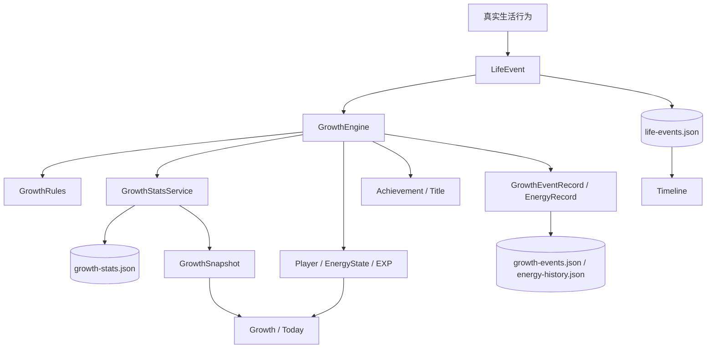

# Life HUD 架构与主要调用链

## 总体调用图

```mermaid
flowchart TD
    Browser[浏览器 app.js] -->|GET /state| Controller[GameController]
    Browser -->|POST /command| Controller
    Browser -->|GET /actions/{name}/duration-options| Controller

    Controller --> Facade[GameCommandFacade<br/>命令识别与协调]
    Controller --> Query[GameQueryService<br/>只读查询入口]

    Facade --> Action[ActionService]
    Facade --> Task[TaskService]
    Facade --> Shop[ShopService]
    Facade --> Title[TitleService]
    Facade --> Progression[ProgressionService]
    Facade --> Logs[LogRepository]

    Query --> Assembler[GameViewAssembler]
    Assembler --> State[GameStateView]
    Assembler --> Player[Player]
    Assembler --> Level[LevelService]
    Assembler --> Titles[TitleSystem]
    Assembler --> Daily[DailyTaskManager]
    Assembler --> Special[SpecialTaskManager]
    Assembler --> ShopManager[ShopManager]
    Assembler --> Achievements[AchievementSystem]
    Assembler --> Logs

    Action --> PlayerService[PlayerService]
    Action --> Titles
    Action --> PlayerRepo[PlayerRepository]
    Action --> Progression

    Task --> Daily
    Task --> Special
    Task --> PlayerService
    Task --> Titles
    Task --> ShopManager
    Task --> PlayerRepo
    Task --> Progression

    Shop --> ShopManager
    Shop --> Daily
    Shop --> Special
    Shop --> Logs

    Progression --> AchievementService[AchievementService]
    Progression --> Level
    AchievementService --> Achievements
    AchievementService --> Titles
    AchievementService --> PlayerService
    AchievementService --> PlayerRepo

    PlayerRepo --> FileStore[JsonFileStore<br/>通用 JSON 文件读写]
    Logs --> FileStore
    Daily --> FileStore
    Special --> FileStore
    ShopManager --> FileStore
    FileStore --> Data[(data/*.json\nlog.txt)]
```

## 典型命令链







## 查询链



## Focus 调用链



计时的业务事实保存在后端：运行态使用“已累计有效秒数 + 当前活动片段”，暂停时固化累计秒数并清空活动起点。前端只负责依据 API 快照显示时间，因此刷新页面或浏览器标签页降频不会重置 Session。



同一时间只允许一个 `RUNNING` 或 `PAUSED` Session。Today Summary 采用“按 Session 开始日归属”的明确规则：跨日 Session 保存完整实际时长，但午夜后不会计入新一天，也不会被拆分或重复统计。

铁幕视觉是前端对 `IRON_CURTAIN` 的表现层增强，不引入第二套业务状态机：开幕、壁纸铁幕态、暂停氛围与落幕提示都由同一个 Session 状态驱动。铁幕态只调整现有壁纸的滤镜与遮罩，因此兼容用户自定义壁纸，也为后续可配置视觉强度保留了独立 CSS 状态入口。

`FocusSession` 是聚合根，内嵌按顺序且不重叠的 `FocusSegment`。Session 的实际时间排除暂停，有效时间由 FOCUS Segment 统一推导；BREAK 与 INTERRUPTION 只进入实际运行。暂停会关闭活动段，恢复创建续段，保证同一时刻至多一个活动 Segment。v0.3 跨日统计按 Session 开始日归属，Segment 保持完整且不重复。

## 关键类职责

| 类 | 所属职责 | 说明 |
|---|---|---|
| `GameController` | HTTP 适配 | 只处理 `/state`、`/command` 和时长选项路由 |
| `GameCommandFacade` | 应用命令入口 | 识别命令并委托给具体 Service |
| `GameQueryService` | 查询入口 | 只读，不修改业务状态 |
| `GameViewAssembler` | ViewModel 组装 | 维持原有前端字段、按钮状态和命令 payload |
| `ActionService` | 行动用例 | 普通行动和计时行动的结算编排 |
| `TaskService` | 任务用例 | 每日任务、特殊任务奖励与进度触发 |
| `ShopService` | 商店用例 | 购买后的日志和商品副作用编排 |
| `ProgressionService` | 进度协调 | 统一触发成就、称号和等级事件 |
| `PlayerService` | 玩家状态变更 | 能量、经验、金币、解锁和计数变更 |
| `TitleSystem` | 称号规则 | 解锁条件、效果和奖励加成 |
| `AchievementSystem` | 成就规则 | 成就条件判断 |
| `DailyTaskManager` | 每日任务状态 | 抽取、刷新、完成和任务文件同步 |
| `SpecialTaskManager` | 特殊任务状态 | 槽位、抽取、刷新、完成和任务文件同步 |
| `ShopManager` | 商店规则 | 商品、库存、购买限制和购买效果 |
| `LevelService` | 等级规则 | 经验曲线和升级判断 |
| `PlayerRepository` | 玩家持久化 | `save.json` 读取、保存和旧存档归一化 |
| `LogRepository` | 日志持久化 | `log.txt` 追加和最近日志查询 |
| `JsonFileStore` | 文件基础设施 | 通用 JSON、文本读写和原子替换 |
| `FocusService` | Focus 用例 | 唯一 Session、状态切换、有效时长与 Today/History 查询 |
| `FocusSessionRepository` | Focus 持久化 | `focus-sessions.json` 的兼容读取与原子保存 |
| `GameCore` | 兼容别名 | 无状态，仅为旧直接调用方保留；生产入口是 `GameCommandFacade` |

## 依赖边界



生产代码中应保持以下约束：

- Service 不依赖 `GameCore`。
- 查询组装不依赖 `GameCore`。
- `JsonFileStore` 不知道 Player、Task、Shop 或 Log 的业务含义。
- Controller 不直接修改领域对象。
- 业务 Service 使用 Spring 构造注入，不在业务流程中手动创建其他 Service。

## v0.1.1：强类型化的首个收敛点

v0.1.1 从成就子域开始清理 Python 风格的动态数据访问：

- `AchievementRepository` 是 `achievements.json` 的唯一解析边界，负责把 JSON 转成 `AchievementDefinition`。
- 成就条件使用 `AchievementConditionType`，组合任务使用 `TaskRequirement` 与 `TaskSource`；规则代码不再解析 `Map<String, Object>` 或执行 unchecked cast。
- `AchievementSystem` 只接受领域定义并返回领域定义。为不破坏现有前端状态结构，它保留了一个仅供读取组装器和旧直接调用方使用的 Map 兼容适配器。
- `TaskService` 到称号奖励链路已使用 `TaskSource` 枚举。JSON 中的 `daily` / `special` 字符串只在转换边界或旧兼容重载出现。

后续同样的迁移路径适用于称号和商店：先在 repository 层完成 JSON 映射，再让服务仅处理领域类型，最后由 `GameViewAssembler` 在 HTTP 响应边界组装既有字段。

## v0.4：事件驱动成长链



`LifeEvent` 是成长层唯一输入，持久化 `sourceType`、`sourceId`、`description` 与 schema `version`，同时兼容读取 v0.2-v0.3 的 `source` / `content` 字段。`GrowthEngine` 以 `eventId` 在 `growth-events.json` 中幂等处理，同一事件不会重复发放 EXP、Energy、Achievement 或 Title。

核心循环（v0.4.2）：现实积极行为（Focus / Task）通过 LifeEvent 只产出 Energy（EARN，每 3 有效分钟 +1、单事件上限 80）；娱乐与生活消费由 `EntertainmentRecordService` 记录事实（`ENTERTAINMENT_RECORDED`）并复用 `EnergyLedgerService` 记为 SPEND 事件，`GrowthEngine` 按 clamp 后的实际消耗量（actualEnergySpent）结算 EXP——`pool = 余数 + 实际消耗`，每 `energy_per_exp`（默认 10）点沉淀 1 EXP，整数余数持久化在 `save.json` 的 `exp_conversion_remainder`；DECAY / ADJUST 不产生 EXP 也不触碰余数池；新的一天 Energy 由 `EnergyDriftService` 向基准值回归一次（`data/content/energy-drift.json` 的 midpoint 与 day_start_factor，ADJUST 记账）。Energy 变化带 `EnergyChangeType`（EARN / SPEND / DECAY / ADJUST）与 `requestedDelta` 落入 `energy-history.json`；数值参数全部外置在 `growth.json`，成就与称号目录及全部成长文案外置在 `data/content/`（由 `GrowthCatalog` / `GrowthCopy` / `AppInfo` 加载）。旧 v0.1 行动命令（`COMPLETE_ACTION` / `COMPLETE_TIMED_ACTION`）已在 facade 层停用，普通业务不存在绕过 GrowthEngine 的 EXP 增长路径。

Growth 页面和 Achievement 检查不扫描全部 Focus / Task / LifeEvent。`GrowthStatsService` 将累计 Focus、有效分钟、最大单次时长、Task、LifeEvent 与 Milestone 数写入 `growth-stats.json`，日常事件只做增量更新；仅首次迁移和显式 `POST /api/growth/recalculate` 会扫描旧事实重建统计。`GrowthSnapshot` 按日期 upsert，趋势层再把累计快照转换为每日 Focus、EXP、Task 与 Energy 数据。

Energy 当前值通过强类型 `EnergyState` 暴露，变化历史通过 append-only `EnergyRecord` 保存。Achievement 使用 `GrowthConditionType`（COUNT、TOTAL_DURATION、SINGLE_DURATION、STREAK、LEVEL、VALUE_THRESHOLD、CUSTOM）和 `GrowthMetric` 描述条件，避免把规则写死在页面或控制器。
